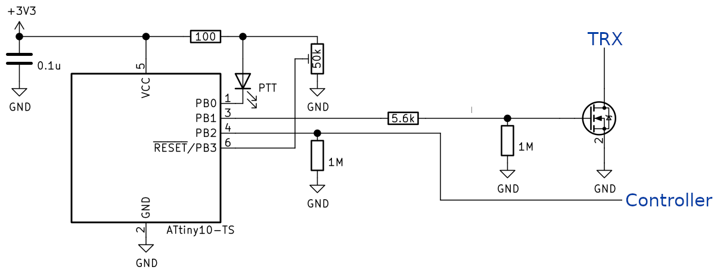
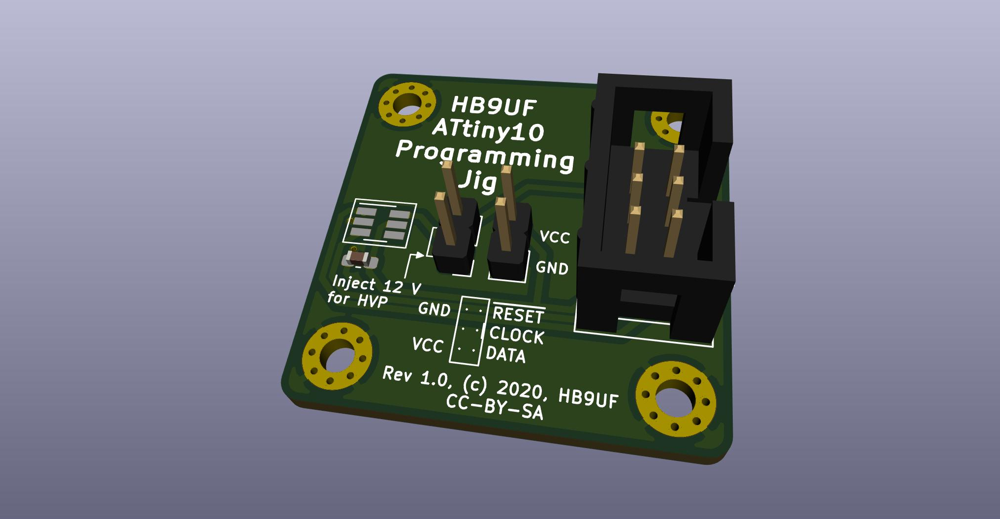

# Introduction

Quasselsperre is an AVR ATtiny-based timeout-timer watchdog, i.e. hardware
circuitry to clear PTT in case it is asserted for an extended amount of time.
This is useful e.g. in a repeater controller, or in an EchoLink interface
controlled by a Raspberry Pi. In case the Raspberry Pi locks up and asserts PTT
indefinitely In case the Raspberry Pi locks up and asserts PTT indefinitely,
this circuit kicks in and disables the transmitter until PTT is cleared.

One may argue that is is better to implement this in hardware instead of
firmware, e.g. with a binary counter such as the CD4060. We chose to do this
in a dedicated microcontroller.

# Pinout

The project is based on an [AVR ATtiny 10](https://www.microchip.com/wwwproducts/en/ATtiny10)
microcontroller with the following pinout:

| Pin number | Pin name | Function                                                                                                |
|----------- | -------- | ------------------------------------------------------------------------------------------------------- |
|          1 | PB0      | Status LED. Connect to LED cathode(!)                                                                   |
|          2 | GND      | Connect to ground                                                                                       |
|          3 | PB1      | PTT output, active high. Connect to base of BJT or gate of FET for open-collector/open-base operation   |
|          4 | PB2      | PTT input, active high. Expects a control voltage ≤ VCC from repeater controller or raspberry pi        |
|          5 | VCC      | Supply voltage, 1.8 V to 5.5 V                                                                          |
|          6 | PB3      | ADC input, see text. Do not leave floating                                                              |

The two input pins must not be left floating.  Add a pull-down if there is any
chance for the PTT input driver to become Hi-Z. On startup, the voltage on the
ADC input is sensed and the timeout delay (i.e. the time after which the watchdog
kicks in) is set according to the following rule: The voltage range between GND
is divided into 8 sub-ranges. If the voltage falls within the lowest range, the
timer is set to 15 minutes. The next range allows for a transmit duration of
30 minutes; each subsequent range add another 15 minutes, yielding a maximal
transmit duration of 2 hours. The pin can be tied low or high with a single
resistor for 15 minutes or 2 hours, respectively, or a resistive divider /
potentiometer can be used to set intermediate values. On startup, the LED
flashes once for each 15 minutes. The pin is only read on startup.

Beware that the LED output pin will sink current: It is Hi-Z when the LED is off
and grounded when the LED is on. In consequence, the LED cathode must connect
to this pin and the LED anode must connect to VCC, of course in series with the
usual current limiting resistor. The PTT output pin is connected to a transistor
as indicated in the table above.



# Compiling and programming

Run the `make` command to compile the firmware. This requires `avr-gcc` along
with the corresponding AVR standard libraries. Alternatively, a pre-compiled
firmware binary is available in the Release-section of the github project page.

Use your programmer and programming software of choice to load the firmware
into the chip. E.g. with `avrdude` and an AVR ISP 2, the following command
can be used:

```
avrdude -c avrisp2 -P usb -p t10 -U flash:w:quasselsperre.hex:i
```

For the ADC functionality to work as indicated above, the `RSTDISBL` fuse must
be used since the ADC pin is also the reset pin:

```
avrdude -c avrisp2 -P usb -p t10 -U fuse:w:0xfe:m
```

Note that after this, you will not be able to reprogram the microcontroller
unless you use the 12 V high-voltage programming option. Since Quasselsperre
has a single, simple task, we believe this to be an acceptable compromise –
the microcontroller probably needs to be programmed a single time or could
even be ordered pre-programmed. For programming, we provide a small jig in the
`programming_jig` subdirectory: The chip can be momentarily pressed onto the
pads of a SOT-23-6 footprint on the jig while the programming takes place.



# License

The Quasselperre code is licensed under the terms of the GPLv2 license. The
artwork for the programming jig is released under the terms of the CC-BY-SA
license. © 2020.

